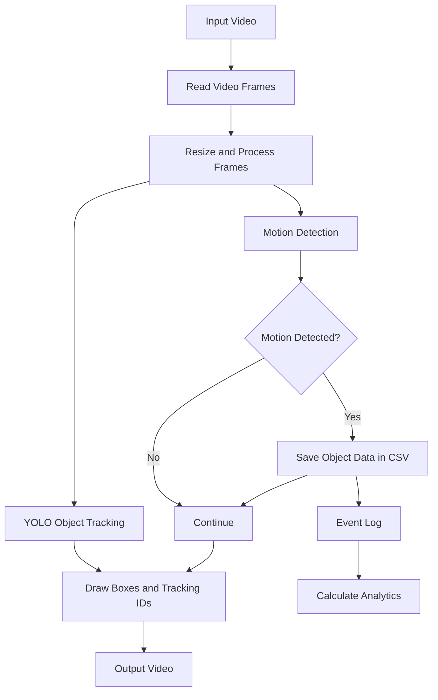

# Design of Smart Surveillance System

## 1. About the Project

We are making a smart surveillance system that can detect
and track objects in a video. Along with this, it checks
for motion and saves information about detected objects.

We used Python, OpenCV and YOLO to build the project.

## 2. How Our System Works

The system takes a video as input and processes it frame
by frame. Each frame is resized before object tracking
and motion detection are performed.

YOLO is used to detect and track objects. The motion
detection module checks the difference between consecutive
frames.

When motion is detected, information about tracked objects
is saved in a CSV file. The processed frames are then
used to create the output video.

## 3. System Architecture

## 4. Main Parts of the Project

### Video Input
File: `input/video_reader.py`

This part opens the input video and reads it frame by
frame. It also checks whether the video is available.

### Image Processing
File: `preprocessing/image_processor.py`

This module resizes images, applies Gaussian denoising,
and improves contrast. It also contains grayscale
conversion.

### Object Detection
File: `detection/object_detector.py`

This module uses YOLO to detect objects and returns
their class names, confidence values and bounding boxes.

### Object Tracking
File: `tracking/object_tracker.py`

This module uses YOLO tracking to follow objects across
video frames. It also provides tracking IDs.

### Motion Detection
File: `motion/motion_detector.py`

This module compares consecutive frames to check for
changes that may indicate motion.

### Event Logging
File: `logging_module/event_logger.py`

When motion is detected, the program saves information
about tracked objects in a CSV file.

### Analytics
File: `analytics/analytics.py`

This module reads the event log and calculates basic
statistics, such as total recorded events, unique object
IDs, object types and average confidence.

### Configuration
File: `config/config.py`

This file contains settings such as input and output
paths, model path, frame width and motion thresholds.

### Main Program
File: `main.py`

This file connects the different parts and runs the
complete video processing process.

## 5. Working Flow

1. The program opens the input video.
2. It reads one frame at a time.
3. The frame is resized and processed.
4. YOLO detects and tracks objects.
5. The motion module checks for changes between frames.
6. If motion is detected, object information is written
   to the CSV file.
7. Bounding boxes and tracking information are drawn.
8. The processed frames are saved as a video.
9. Analytics are calculated from the CSV file.

## 6. Output

Our program generates two main outputs:

- `output/surveillance_output.mp4` — video showing
  detection and tracking results.
- `output/events.csv` — records of tracked objects
  during detected motion.

The program also prints basic statistics after processing.

## 7. Current Limitations

- The program currently takes a video file as input.
- Motion detection is based on frame differences.
- The same object can appear in multiple CSV records.
- The system does not decide whether an activity is
  suspicious or dangerous.

## 8. Future Work

We can improve the project by adding live camera input,
reducing repeated event records, and adding notifications
for selected events.